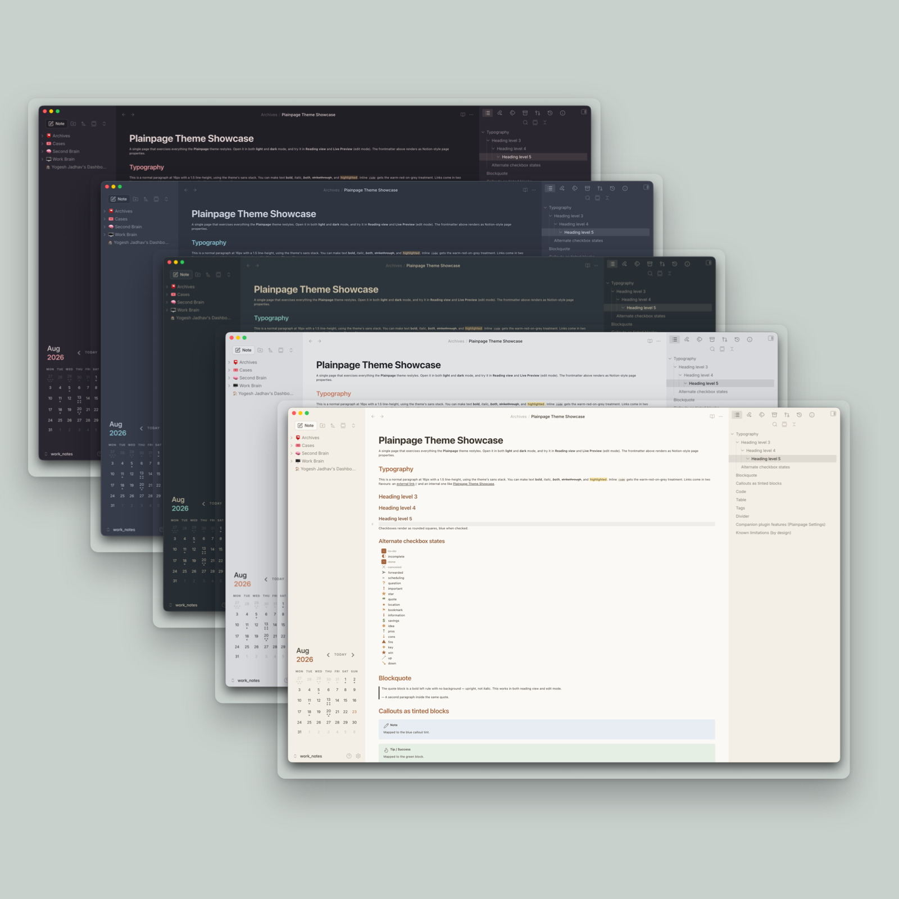
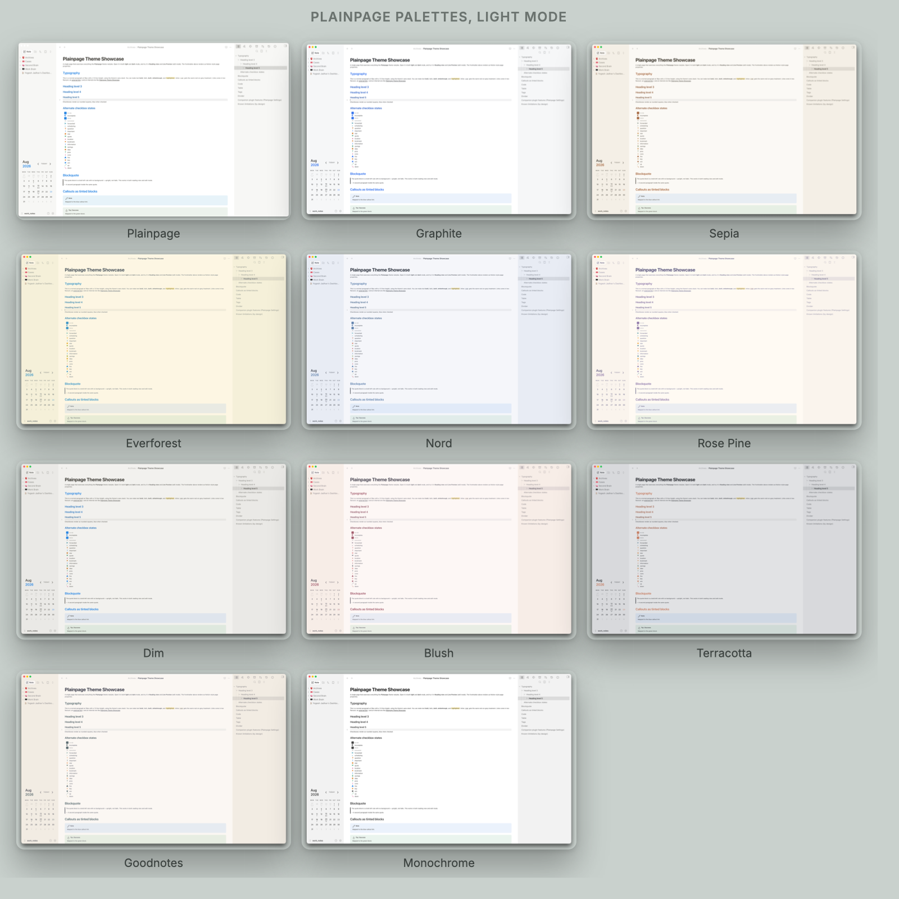
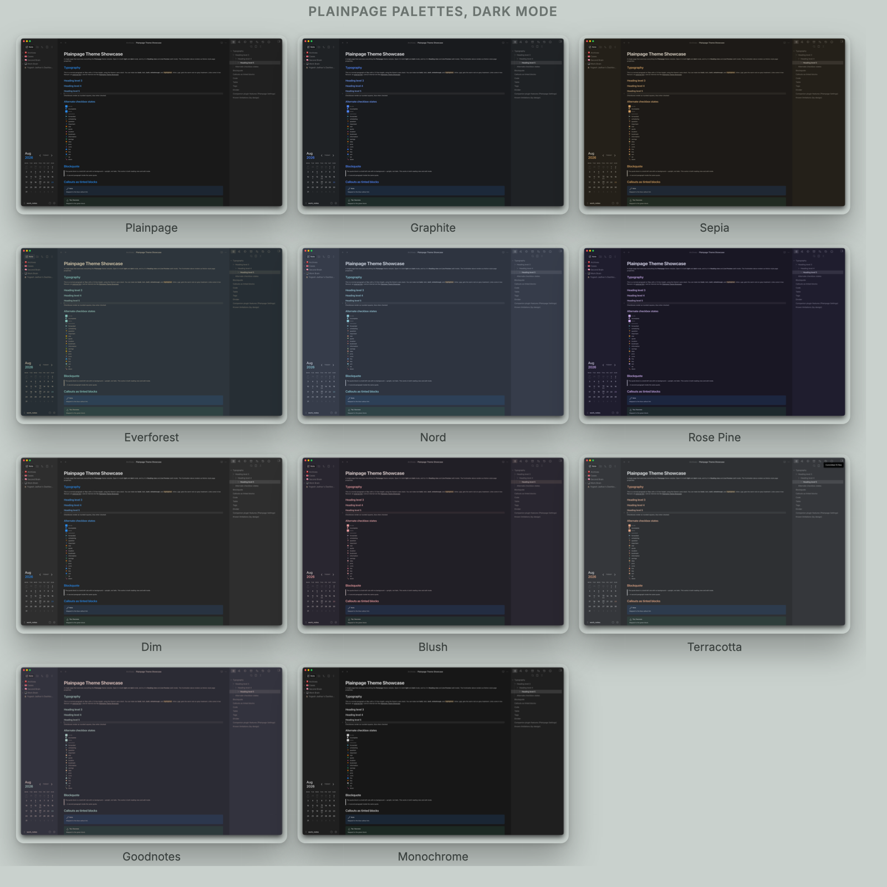

# Plainpage

A calm, document-first theme for [Obsidian](https://obsidian.md), inspired by the way Notion presents a page. Flat surfaces, quiet borders, a comfortable reading column, and eleven colour palettes. Light and dark mode.

Plainpage is an independent project. It is not affiliated with, endorsed by, or connected to Notion Labs, Inc.



## Install

**From Obsidian** (once it is in the directory): Settings, Appearance, Themes, Manage, then search for Plainpage.

**Manually:** download `manifest.json` and `theme.css` from the [latest release](https://github.com/pgyogesh/obsidian-plainpage-theme/releases) into `<vault>/.obsidian/themes/Plainpage/`, then pick Plainpage under Settings, Appearance.

## What it covers

The whole window, not only the note:

| Area | Treated |
| --- | --- |
| Ribbon and left sidebar | Flattened into one quiet surface |
| Workspace tabs and title bar | Yes |
| Editor, both source and reading view | Yes |
| Right sidebar panels | Yes |
| Command palette and quick switcher | Yes |
| Settings modal | Yes |
| Status bar, scrollbars, buttons, inputs | Yes |
| Callouts, code blocks, tables, tags, properties | Yes |

## Palettes

Eleven schemes, each hand-tuned for light and dark separately. Switch them from the companion plugin.

| Palette | Character |
| --- | --- |
| Plainpage | The default. Warm off-white paper, blue accent. |
| Graphite | Cool neutral grey |
| Sepia | Warm paper |
| Everforest | Muted green |
| Nord | Arctic blue-grey |
| Rosé Pine | Muted mauve |
| Dim | Soft contrast: darker light, lighter dark |
| Blush | Warm rose and mauve |
| Terracotta | Warm grey and clay |
| Goodnotes | Peach, clay and sage |
| Monochrome | Greyscale only. Hierarchy through tone, not hue. |





A palette redefines only the `--nt-*` design tokens. Everything else follows automatically.

## Companion plugin

[Plainpage Settings](https://github.com/pgyogesh/obsidian-plainpage-settings) is optional. The theme looks complete without it. Install it if you want the palette switcher, the optional layout modes, page icons and cover banners.

The plugin works by toggling `plainpage-*` classes on `<body>`. The theme styles those classes. Neither one needs the other to load.

## Customising

Every colour, radius, spacing and font size is a CSS custom property, declared once at the top of `theme.css`. To change something, add a snippet:

```css
body {
  --nt-line-width: 800px;      /* wider reading column */
  --nt-accent: #2d9964;        /* green accent */
}
```

The file is organised into numbered regions, each with a comment explaining what it does and why. Start there rather than searching for a selector.

## Known limitations

Some Notion behaviours cannot be reproduced in CSS alone. These are documented in a block at the end of `theme.css` rather than faked. The short version: the block drag handle is visual only, and anything needing new DOM nodes or drag behaviour is out of scope for a theme.

## Support

If Plainpage is useful to you: [buy me a coffee](https://www.buymeacoffee.com/pgyogesh).

## Reproducing the screenshots

Every image here is a real capture of the running app, composed by a script, so
the set can be rebuilt whenever the CSS changes.

1. Open `Archives/Plainpage Theme Showcase` and scroll to the top.
2. Walk the palette list in the companion plugin's own order, capturing each one
   with `Cmd+Shift+4` then `Space` then a click on the window. Do all of light
   mode first, then all of dark. Keep the window the same size throughout.
3. Put the files in `~/Desktop/plainpage-shots/`. Filenames do not matter.
4. Run `docs/make-screenshots.py`.

The script identifies each capture by the order it was taken, then verifies that
against the `--nt-bg` the palette declares in `theme.css`, and stops if any
capture is more than 8 units away from where it should be. Colour alone cannot
do the job: Plainpage, Graphite and Monochrome are all pure white in light mode,
and Rose Pine, Blush and Goodnotes sit within 5 units of each other.

Composition is HTML rendered by macOS Quick Look, so there is no browser to
install.

## Licence

MIT. See [LICENSE](LICENSE).
